# Artworkia - Artworks Sharing Platform

:wave: Welcome to our Capstone Project - Artworkia (back-end project) :wave:

## Table of Contents
  - [Description](#description)
  - [Preview Screenshot](#preview-screenshot)
  - [Technology](#technology)
  - [Functional requirements](#functional-requirements)
  - [Useful Resources](#useful-resources)
  - [Contributors](#contributors)
  - [License & Copyright](#license--copyright)

## Description
- APIs for a social web application platform for digital artworks.
- This project was developed as part of the Final Capstone project (Group GSP24SE42) - Sum24 at FPT University HCMC.
- This project started from 04-12-2023 to 30-04-2024.

## Preview Screenshot

  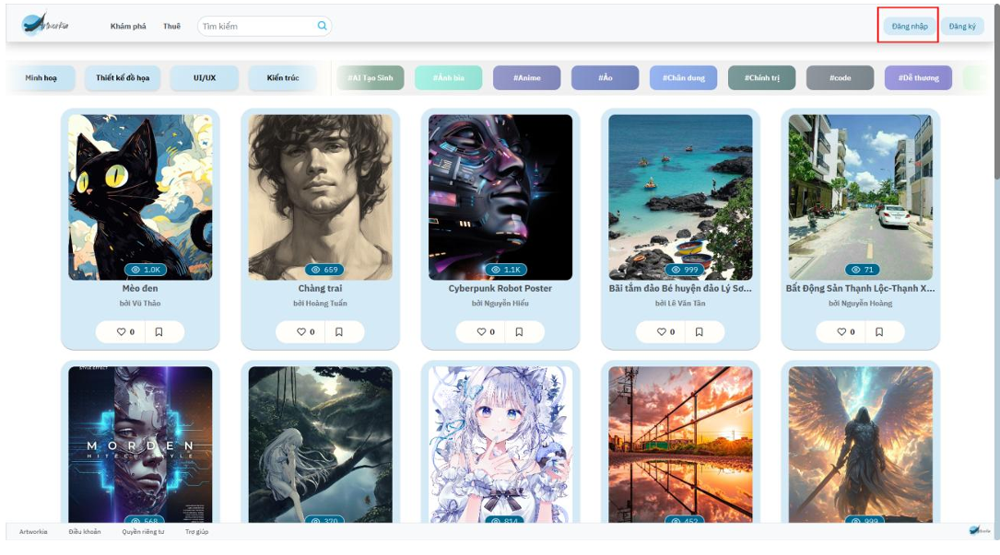</img>  
  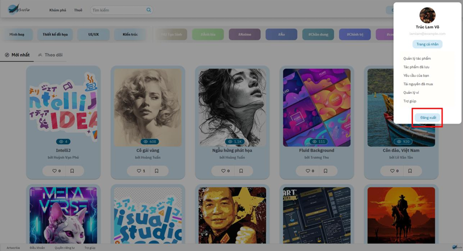</img> &nbsp;&nbsp;
 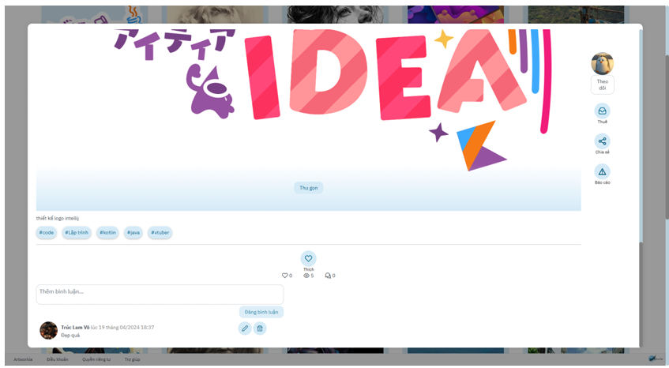</img>
 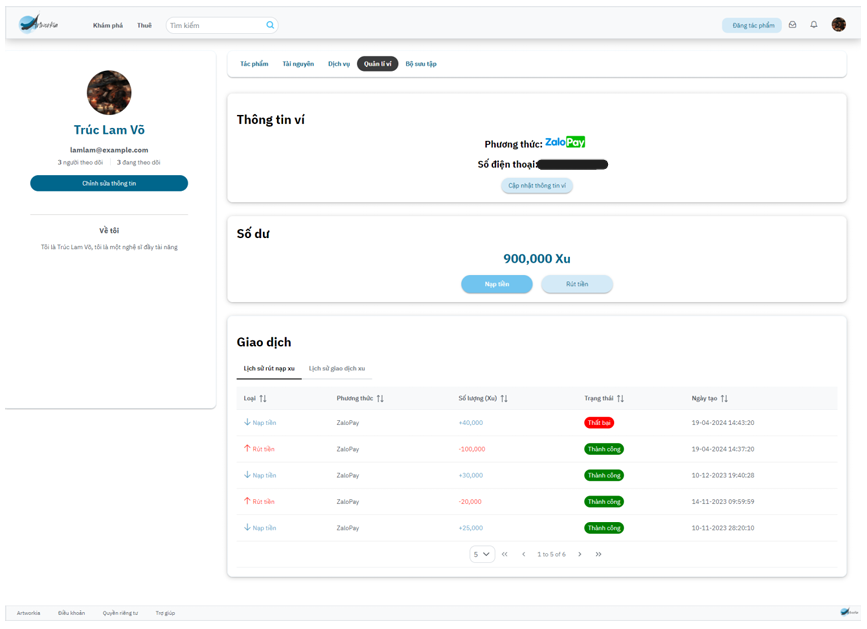</img>  &nbsp;&nbsp;
  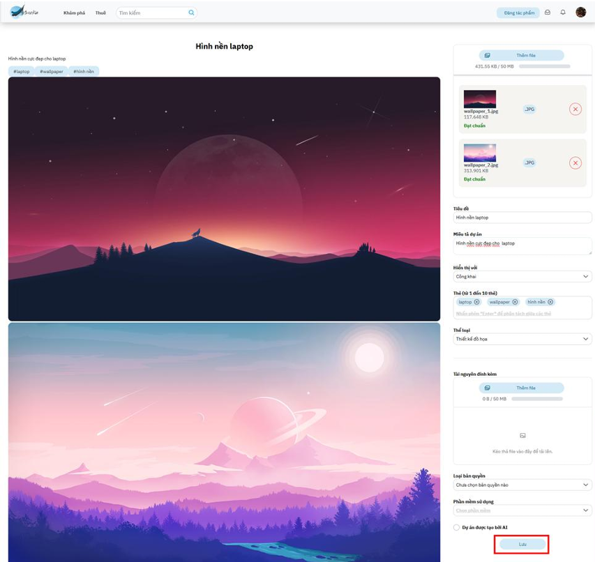</img>

  
 
Show more images

    </img>  &nbsp;&nbsp;
  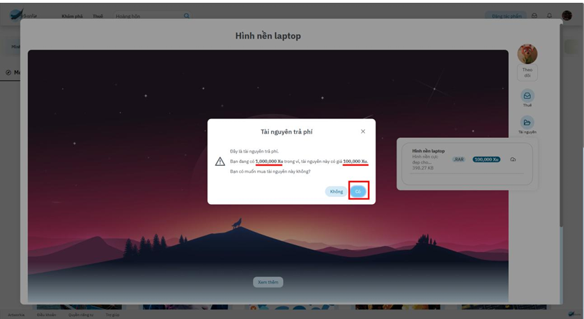</img>
  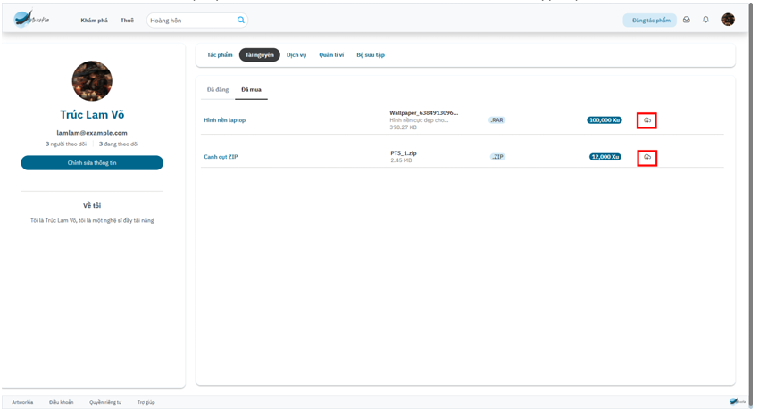</img>  &nbsp;&nbsp;
  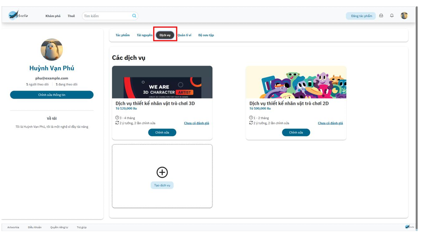</img>
  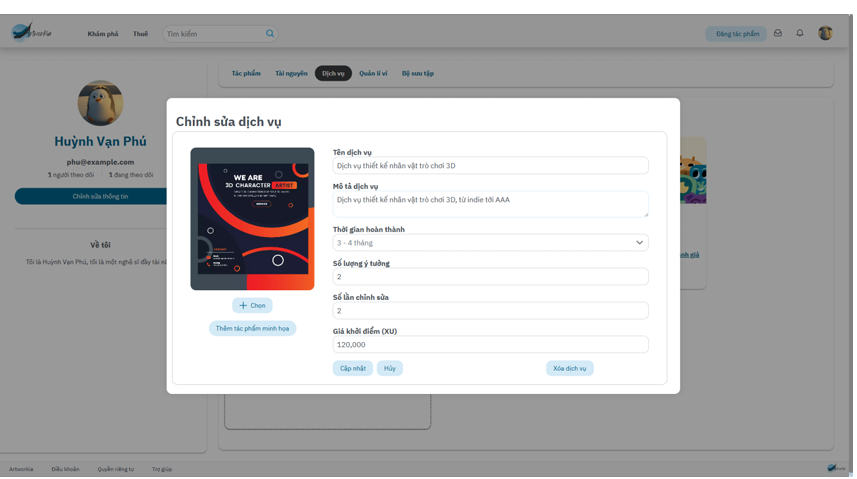</img>  &nbsp;&nbsp;
  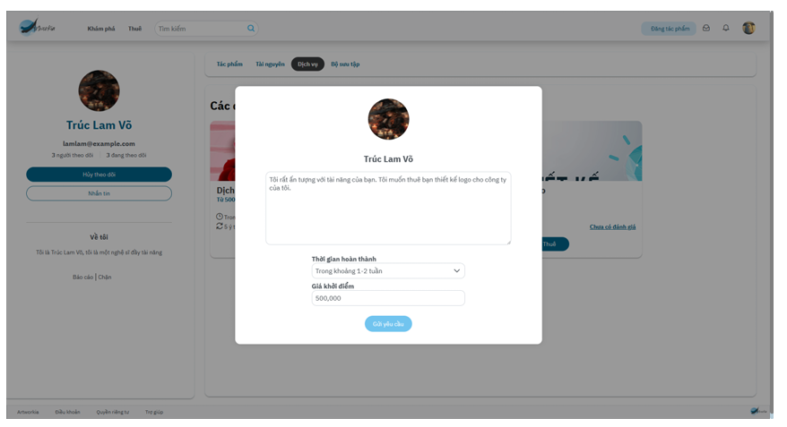</img>
  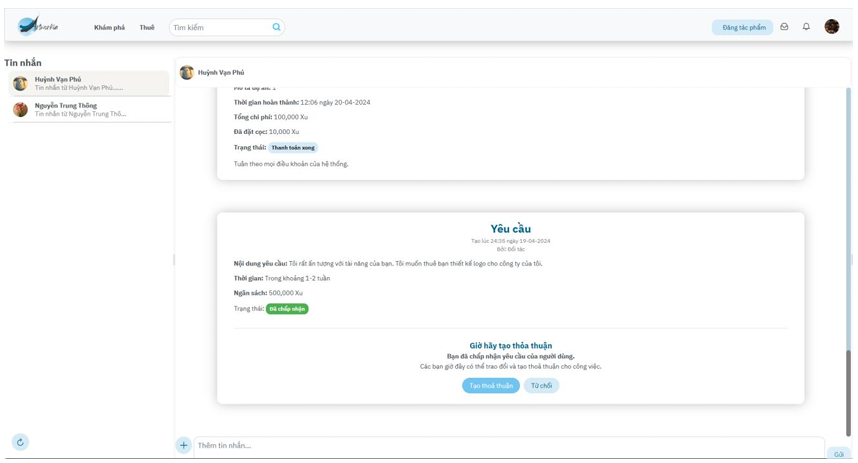</img>  &nbsp;&nbsp;
  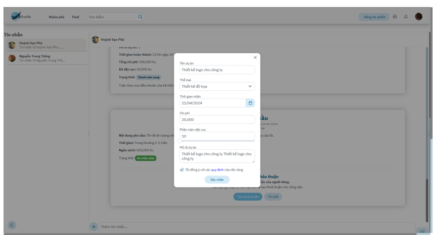</img>
  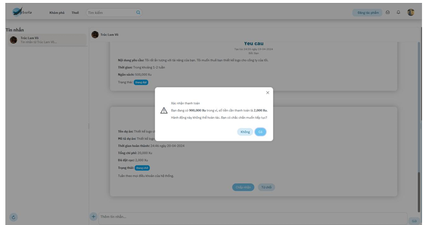</img>  &nbsp;&nbsp;
  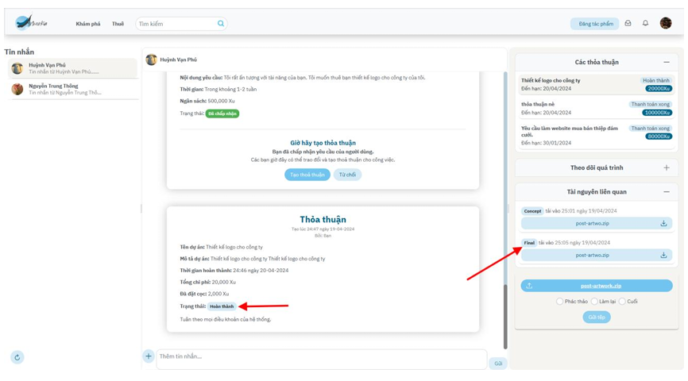</img>        
  

## Technology
**Client:** ReactJS, NSFWJS, PrimeReact

**Server:** ASP.NET API 7, Microsoft SQL Server

**Deployment:** Docker, Jenkins, Google Cloud, Firebase Hosting

**Third-party:** ZaloPay, Elastic Search, Cloudflare

## Functional requirements
**1. Guest:**
- [x]  Login
- [x]  Login by Google
- [x]  Register

**2. Creator:**
- [x]  Profile Management
- [x]  Artwork Management
- [x]  Asset Management
- [x]  Service Management
- [x]  Proposal Management
- [x]  Chat
- [x]  Report
- [x]  Notification

**3. Audience**
- [x]  Collection Management
- [x]  Request Management
- [x]  Chat
- [x]  Report
- [x]  Notification

## Useful Resources

#|Name | Description
-|---- | -----------
1|[Back-end Source code](https://github.com/vliam0206/artworkia-capstone-public) | Back-end main source code
2|[Front-end Source code](https://github.com/thongnt0208/artworks-sharing-platform) | Front-end main source code

## Contributors
**1. Mentor:**
- Lecturer - Main Mentor: Nguyen Thi Cam Huong

**2. Members:**
- [Vo Ngoc Truc Lam](https://github.com/vliam0206) - SE160857 - **Leader | Back-end Developer**
- [Huynh Van Phu](https://github.com/hvpexe) - SE140456 - **Back-end Developer | DevOps**
- [Dang Hoang Anh](https://github.com/danghoanganh36) - SE160846 - **Front-end Developer**
- [Nguyen Trung Thong](https://github.com/thongnt0208) - SE160850 - **Front-end Developer**

## License & Copyright 
&copy; 2024 GSP24SE42-SP24SE061-Artworkia

